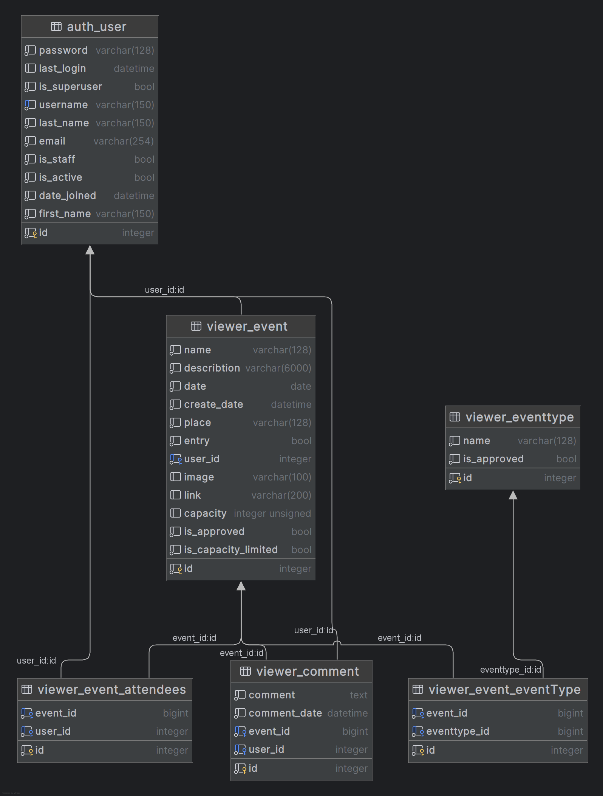
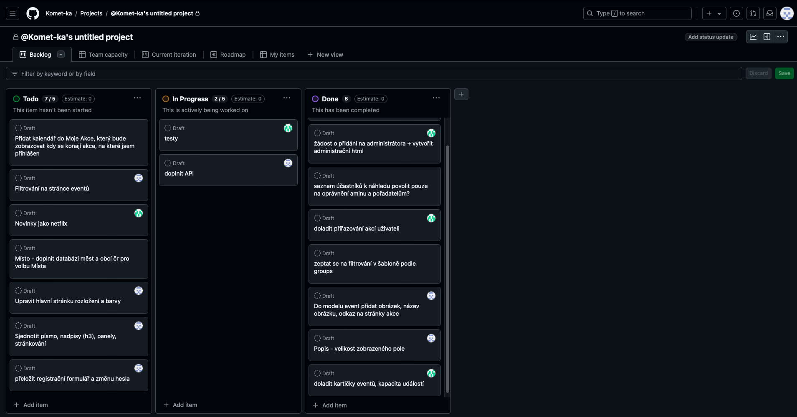

# Event Manager
Popis aplikace:  Webová aplikace s názvem EventManager je psaná v programovacím jazyce Python (verzi 3.12) a postavena na webovém frameworku Django.
  
Cílem tohoto projektu je vytvoření platformy pro správu a evidenci různých událostí v podobě webové aplikace.  
Pro zajištění efektivního využití jsou implementovány tři úrovně oprávnění, které umožňují různé možnosti správy a přístupu k událostem. 
  
- Nepřihlášený uživatel:  
Nepřihlášeným uživatelům je umožněn pouze náhled veřejně dostupných událostí, včetně zobrazení jejich detailů a čtení komentářů. Uživatelé se mohou registrovat nebo přihlásit ke svému existujícímu účtu. 
   
- Účastník: 
Uživatel s tímto oprávněním může spravovat svůj uživatelský účet (změna jména, emailu, hesla) a přihlašovat se na jednotlivé akce. Dále může přidávat komentáře a také je později mazat. 
  
- Pořadatel:  
Pořadatelé mají stejná oprávnění jako účastníci a navíc mohou vytvářet nové události. V jejich sekci "Moje akce" jsou události rozděleny na dvě části: jako účastník a jako pořadatel. Pořadatelé mohou své události upravovat a mazat, ale nově vytvořené události jsou nejprve odeslány ke schválení a nejsou tak na webu viditelné okamžitě. 
  
- Administrátor: 
Administrátor má všechna oprávnění pořadatele a účastníka a navíc má právo schvalovat nové události. Administrátor může upravovat a mazat všechny události, spravovat komentáře, a navíc má plnou kontrolu nad typy událostí, které nejsou přístupné jiným uživatelům.
  

ER diagram modelů:

Ukázka práce s Backlogem:

Checklist základních bodů ke splnění:
- [x] zprovoznit git
- [x] vytvořit aplikaci
- [x] dostat se do admin rozhraní
- [x] vytvořit modely a udělat migrace
- [x] vytvořit hlavní HTML stránku
- [x] názvy přepsat do češtiny
- [x] upravit záhlaví
- [x] doplnit vyhledávací pole
- [x] upravit event formulář
- [x] prohodit logování a my account uživatele
- [x] zvětšit description area
- [x] event type, ať se zobrazují názvy místo čísel
- [x] kalendář - výběr data
- [x] schovat create date
- [x] vstupné - odkázat na description
- [x] zkusit tam dát barvy a třeba i obrázky
- [x] event types - dát do levého panelu pod sebe
- [x] doplnit validátory k polím
- [x] oprávnění

Pro zajištění korektních migrací:
python .\manage.py makemigrations viewer
