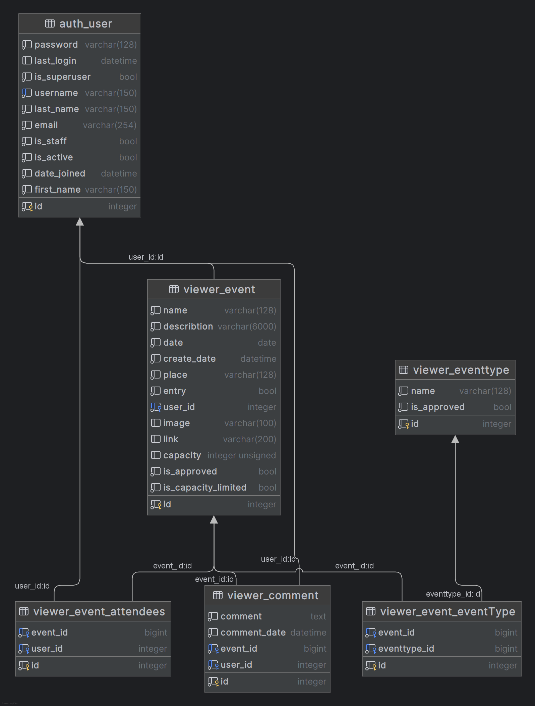

# Final_project

- [x] zprovoznit git
- [x] vytvořit aplikaci
- [x] dostat se do admin rozhraní
- [x] vytvořit modely a udělat migrace
- [x] vytvořit hlavní HTML stránku

- [x] názvy přepsat do češtiny
- [ ] upravit záhlaví
- [x] doplnit vyhledávací pole
- [x] upravit event formulář
- [x] prohodit logování a my account uživatele
- [x] zvětšit description area
- [x] event type, ať se zobrazují názvy místo čísel
- [x] kalendář - výběr data
- [x] schovat create date
- [x] vstupné - odkázat na description
- [ ] zkusit tam dát barvy a třeba i obrázky
- [x] event types - dát do levého panelu pod sebe
- [ ] doplnit validátory k polím
- [ ] oprávnění

- [ ] prezentační vrstva - templates (předveďte dědičnost v šablonách, rozmístění šablon do     jednotlivých adresářů (dle daných aplikací), struktura kódu (správné odsazení, čitelnost, případně komentáře), výslednou html stránku pak můžete otestovat na webu:
https://validator.w3.org/#validate_by_input)
- [ ] databázová vrstva - ER diagram, propojení modelů
- [ ] Testy - od každého typu testu (models, forms, GUI,...)
- [ ] Validace vstupních dat - chyby zobrazit zvýrazněně
- [ ] autorizace a autentizace
- [ ] specifické části kódu (reset hesla)
- [ ] GIT repozitář - merge, komentáře commitů, gitignore soubor
- [ ] readme soubor (toto vypadá jako nepodstatná maličkost, ale je to přesně ta první věc, kterou každý návštěvník vašeho online repozitáře uvidí, je to vaše vizitka a stručný popis celého projektu)
- [ ] celková kvalita kódu - ukázka views, tříd, metod a funkcí

python .\manage.py makemigrations viewer

